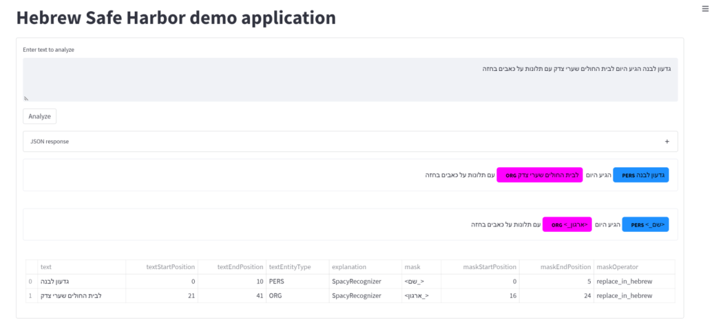

# HebSafeHarbor

A de-identification toolkit for clinical text in Hebrew.

[](http://opensource.org/licenses/MIT)  [](https://badge.fury.io/py/hebsafeharbor) [](https://img.shields.io/pypi/dm/hebsafeharbor.svg) 

HebSafeHarbor was developed according to the requirements described in הצעה למתווה התממה של טקסט רפואי - נמל מבטחים (read more [here](docs/))

The toolkit integrates and uses open source libraries and assets, including [HebSpacy](https://github.com/8400TheHealthNetwork/HebSpacy), [Presidio](https://microsoft.github.io/presidio/), Wikipedia and public lexicons.


## Installation

To install the package, run the following commands - preferably in a virtual environment
``` sh
# Create conda env (optional)
conda create --name hebsafeharbor python=3.8
conda activate hebsafeharbor

# Install HebSafeHarbor
pip install hebsafeharbor

# Download the he_ner_news_trf model used by hebsafeharbor
pip install https://github.com/8400TheHealthNetwork/HebSpacy/releases/download/he_ner_news_trf-3.2.1/he_ner_news_trf-3.2.1-py3-none-any.whl
```

Alternatively, you may clone the repo and install all dependencies:

``` sh
# Create conda env (optional)
conda create --name hebsafeharbor python=3.8
conda activate hebsafeharbor

# Install dependencies
pip install -r requirements.txt

# (Optional) Install package locally
pip install -e .

# Download the he_ner_news_trf model used by hebsafeharbor
pip install https://github.com/8400TheHealthNetwork/HebSpacy/releases/download/he_ner_news_trf-3.2.1/he_ner_news_trf-3.2.1-py3-none-any.whl
```

## Getting started

### Python

```python
from hebsafeharbor import HebSafeHarbor

hsh = HebSafeHarbor()

text = """שרון לוי התאשפזה ב02.02.2012 וגרה בארלוזרוב 16 רמת גן"""
doc = {"text": text}

output = hsh([doc])

print(output)
```

### Local REST endpoint
HebSafeHarbor can be consumed as a REST endpoint for the service powered by the [FastAPI](https://fastapi.tiangolo.com/) library.
To run the service locally, you will need to first install the environment requirements as follows:  
``` sh
# Create conda env (optional)
conda create --name hebsafeharbor-server python=3.8
conda activate hebsafeharbor-server

# Install dependencies
pip install -r requirements.txt

# Install server dependencies
pip install -r requirements-server.txt
```
Once installation is done, run the following command to initiate the service:
``` sh
uvicorn server:app --reload
```
The service should be running at http://127.0.0.1:8000. Navigate to this URL and make sure you see the following message:
```
{"message":"Welcome to the Hebrew Safe Harbor!"}
```
Now go to http://127.0.0.1:8000/docs to see interactive API documentation (Swagger). 

Alternatively, you can query the service directly by send POST requests to http://127.0.0.1:8000/query with the payload as described in the API documentation.

### Docker
To download and run the official release as a Docker container, run the following commands:
```bash
# Download image 
docker pull hebsafeharbor/hebsafeharbor

# Run container
docker run -d -p 8000:8000 hebsafeharbor/hebsafeharbor:latest
```

Alternatively, you can build and run the Docker container:
```bash
# Build image 
docker build ./ --tag hebsafeharbor_server

# Run container
docker run -d -p 8000:8000 hebsafeharbor_server
```
Navigate to http://localhost:8000 to validate the service is up and running. Similarly, you can go to http://localhost:8000/docs and http://localhost:8000/query.

## Demo application
For experimentation and testing purposes, we provide a [Streamlit](https://streamlit.io/) demo application.

Note that the demo application functions as a (semi-)web client in the sense that it queries the remote REST endpoint and visualizes the results.

In order for the demo to work and interact with the server application, you will need to set `HSH_SERVER` environment variable to the REST point URL. 

For example, assuming you are running the server as docker container:
```
[For Windows]
$env:HSH_SERVER="http://localhost:8080"

[For Linux]
export HSH_SERVER=http://localhost:8080
```

### Run locally
To run the demo locally, first install the requirements as follows:
``` sh
# Create conda env (optional)
conda create --name hebsafeharbor_demo python=3.8
conda activate hebsafeharbor_demo

# Install dependencies
pip install -r demo/requirements_streamlit.txt
```
Once installation is done, run the following command:
``` sh
streamlit run demo/demo_app.py
```
Now go to http://localhost:8501 to access the application

### Docker
To download the official Docker container, run the following commands:
```sh
# Download image
docker pull hebsafeharbor/demo_application

# Run containers with default port
docker run -d -p 8501:8501 hebsafeharbor/demo_application:latest -e HSH_SERVER=<SERVICE URL>
```
Alternatively, you can build and run the Docker container:
```bash
# Build image 
docker build demo/. --tag hebsafeharbor_demo

# Run container
docker run -d -p 8501:8501 hebsafeharbor_demo -e HSH_SERVER=<SERVICE URL>
```
**In case you are running the server as a Docker container, consider following the networking documentation [here](https://docs.docker.com/network/network-tutorial-standalone/)**

Navigate to http://localhost:8501 to access the demo application.

### Docker Compose
You may also consume the service and the demo application through `docker-compose` setup.

Run the `docker-compose` command against the `docker-compose.yml` file in the root directory to get the latest containers from Docker Hub
```sh
docker-compose up -d --build
```
Navigate in the browser to <https://server.localhost/docs> to access the service swagger.
Navigate in the browser to <https://demo.localhost> to test the demo application.


#### Development mode
To run the containers against the repo's code, run the following command:
```sh
docker-compose -f docker-compose-development.yml up -d --build
```

-----

HebSafeHarbor is an open-source project developed by [8400 The Health Network](https://www.8400thn.org/).
